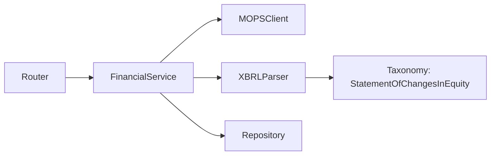

# 權益變動表 設計文件

## 架構概述

採用現有架構模式，新增第四個財務報表端點。

## 報表特性

| 報表類型 | 累計型 | Q4 單季計算 |
|---------|:-----:|:-----------:|
| balance_sheet | ❌ | ❌ |
| income_statement | ✅ | ✅ |
| cash_flow | ❌ | ❌ |
| **equity_statement** | ✅ | ✅ |

權益變動表為**累計型報表**，與損益表相同需要 Q4 單季計算。

## 變更範圍

### 1. Service Layer

`app/services/financial.py`:
- `REPORT_ROLES` 新增 `"equity_statement": "StatementOfChangesInEquity"`
- `CUMULATIVE_REPORTS` 新增 `"equity_statement"`

### 2. Router Layer

`app/routers/financial.py`:
- 新增 `get_equity_statement` endpoint
- 更新 `valid_types` 列表

## 影響分析

- ✅ 無破壞性變更
- ✅ 現有測試不受影響
- ✅ 資料庫 schema 無需修改（`report_type` 為 String）
