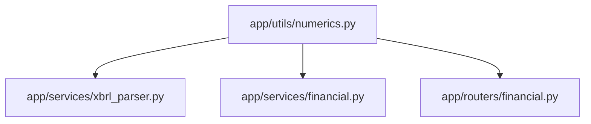

# Impact Analysis: Numeric Utils Refactoring

## Files to be Modified

| File | Action | Changes |
|------|--------|---------|
| `app/utils/__init__.py` | CREATE | 空模組，匯出 utils |
| `app/utils/numerics.py` | CREATE | 數值解析函式 |
| `app/services/xbrl_parser.py` | MODIFY | L196: 使用 `parse_financial_value` |
| `app/services/financial.py` | MODIFY | L175-176, L298, L353: 使用 `parse_financial_value` |
| `app/routers/financial.py` | MODIFY | L206: 使用 `parse_financial_value` |
| `tests/test_numerics.py` | CREATE | 新增單元測試 |

## Files to be Created

- `app/utils/__init__.py`
- `app/utils/numerics.py`
- `tests/test_numerics.py`

## Files that May be Deleted

無

## Dependencies Between Components

順序：先建立 `numerics.py`，再依序更新使用者。

## Potential Breaking Changes

| Risk | Likelihood | Mitigation |
|------|------------|------------|
| 數值解析行為差異 | 低 | 函式設計涵蓋所有現有邏輯 |
| Import 錯誤 | 低 | 明確的模組路徑 |
| 效能下降 | 極低 | 函式呼叫開銷可忽略 |

## Risks and Edge Cases

1. **破折號類型**: 目前有 `-` 和 `—`（全形），需同時處理
2. **科學記號**: 目前未使用，但 Decimal 原生支援
3. **併發安全**: 純函式，無狀態，無風險
